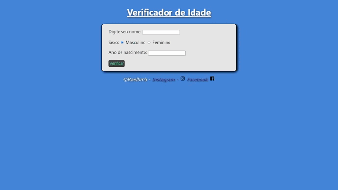

<h1 align="center"> Projeto Teste de Idade </h1>

  <a href="#-tecnologias">Tecnologias</a>&nbsp;&nbsp;&nbsp;|&nbsp;&nbsp;&nbsp;
  <a href="#-projeto">Projeto</a>&nbsp;&nbsp;&nbsp;|&nbsp;&nbsp;&nbsp;
  <a href="#memo-licença">Licença</a>

 

  

## 🚀 Tecnologias

Esse projeto foi desenvolvido com as seguintes tecnologias:

- HTML e CSS
- JavaScript
- Git e Github

## 💻 Projeto

Este projeto é um teste de idade do usuário, onde o usuário coloca algumas informações como nome, sexo e ano de nascimento, e o aplicativo irá dizer a idade, e uma foto aleatória de uma pessoa baseada na idade e sexo da pessoa.